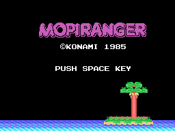
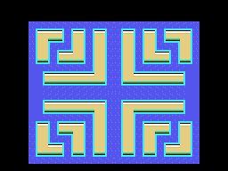
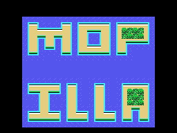

# The game

*Mopi Ranger* is a 1985 maze game. You work through closed zones picking up
what is in them, dodging the enemies, with a hammer you throw in a straight
line.

*The wordmark, drawn from the ROM. It is not a single piece of artwork: it is
three rows of twenty cells with consecutive patterns from 0xC0 on.*

## Fifty zones, twenty-five maps

The scoreboard counts up to fifty zones. Distinct drawings number
**twenty-five**: on reaching 25 the game subtracts 25 from the index and starts
over from the first map, with different enemies and objects.

And of those twenty-five, **one in five is a bonus stage**, and all five share
the same screen.

*The first zone. Each of the map's 120 bytes is a 2x2 block of cells; twelve
across by ten down.*

## How it plays

- You move in four directions, **square by square**. Turning ninety degrees
  requires being centred on a square; a U-turn can be made at any time.
- The button throws the **hammer**, which flies straight until it meets
  something. If it reaches an enemy, it kills it: one hundred points.
- Some blocks can be **pushed**, if there is room on the far side and nobody
  standing there.
- Each zone has a **clock**. When it runs low the scoreboard warning flashes
  and the scenery starts moving at twice the speed.

## The enemies

Five types, and no two behave alike:

| type | what it does |
|---|---|
| 1 | cuts you off: goes where you will be, not where you are |
| 2 | **mirrors** you: copies the direction you press, horizontal axis flipped |
| 3 | heads for your **mirror point**, so it prowls instead of following |
| 4 | like type 1, with a shorter lead |
| 5 | the **big one**: goes for the objects and eats them |

The big one deserves its own paragraph. **It does not cost you a life: it costs
you the zone.** When it stands on an object it wipes it off the board and puts
back whatever was underneath, exactly as if you had picked it up yourself. It
is also the only one allowed to step on the goal squares.

And there is a nice touch: when an enemy goes down, the others **find out**. A
table says, for each one, which three are its neighbours, and those get turned
around.

## The bonus stages

*The bonus stage, the same one for all five zones that use it.*

Clearing it whole gives the **PERFECT BONUS**. And hidden in it is the house
prize: standing on the exact square X=0x90, Y=0x39, the game prints **KONAMI
5730 PTS** and awards those 5730 points.

The number is no accident. Japanese numbers can be read by their sound:
**5 = go, 7 = na, 3 = mi**, that is ***go-na-mi***. Konami put that prize in
many of its games.

## The scoreboard

Six BCD digits, capped at 999999. The high score survives as long as the
machine stays on. Each object is worth an amount that tracks the animation
clock, and the end-of-stage prize is twenty thousand points, added in three
goes because the adder works in decimal and cannot take it in one.

## What you watch but do not touch

The attract mode that runs when nobody is playing **is not AI**: it is 77
recorded keypresses fed in where the joystick input would go. That is covered
in [Findings](FINDINGS.html).
